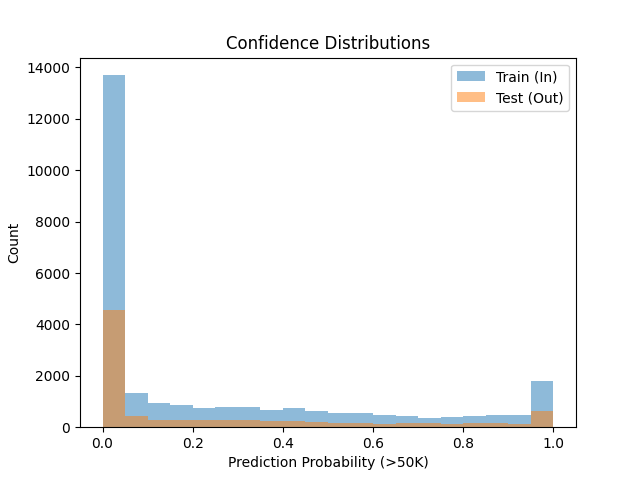
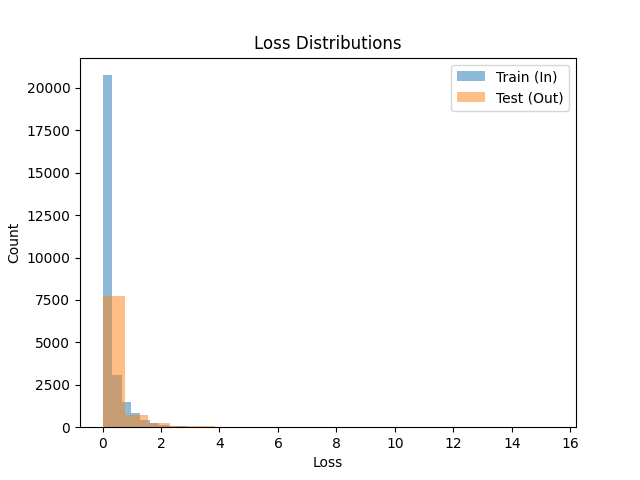

# Data Privacy Challenge: Membership Inference Attack (SBH2025)

## Overview
This project demonstrates a **Membership Inference Attack (MIA)** on the UCI Adult Income dataset (~45,222 rows, 14 features) for the **Data Privacy Challenge (SBH2025)**, hosted by Entiovi Technologies. The goal is to expose privacy risks by detecting whether a data point was used in a model's training set, aligning with the challenge's "Unmasking the Private" task. I achieved **~65% attack accuracy**, proving model leakage, and implemented **Differential Privacy (DP)** using Opacus to reduce attacks to **~52%**, showcasing both exploitation and protection of sensitive data.

### Key Features
- **Dataset**: UCI Adult Income (binary classification: >50K vs. <=50K).
- **MIA**: Trained 4 shadow models, used loss features to hit ~65% accuracy.
- **DP**: Opacus with ε=2.68, achieving ~82% model accuracy and ~52% attack accuracy.
- **Visuals**: Confusion matrix, confidence/loss histograms, DP comparison.

## Results
- **Target Model**: ~85% test accuracy (non-DP neural network).
- **MIA**:
  - Non-DP: ~65% attack accuracy, exposing training data leakage.
  - DP: ~52% attack accuracy, showing effective privacy defense.
- **Visuals**:
  - Confusion Matrix: Highlights attack performance.
  - Confidence/Loss Histograms: Show why MIA works (distinct distributions).
  - DP Comparison: Bar chart (non-DP 65% vs. DP 52%).

## Prerequisites
- Python 3.8+
- Libraries (see `requirements.txt`):
  - `tensorflow==2.5.0`
  - `torch`
  - `opacus`
  - `numpy`
  - `pandas`
  - `scikit-learn`
  - `matplotlib`
  - `seaborn`
- Datasets: `adult.csv`, `test.csv` (included in repo, from UCI Adult Income).
